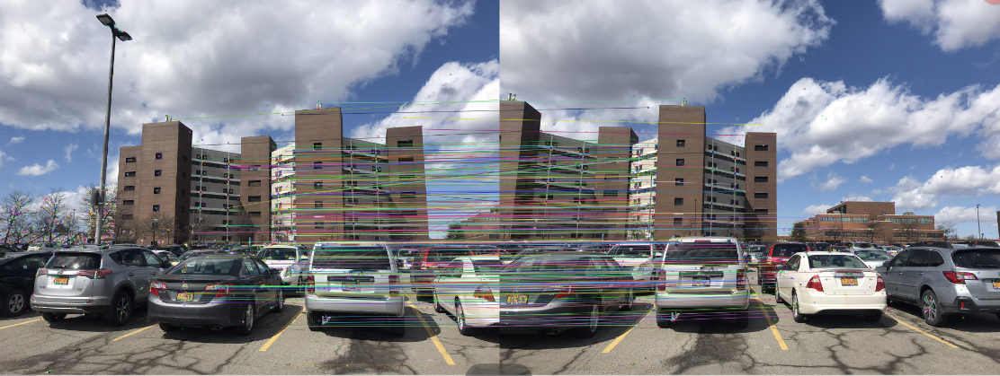

# Panorama-Image-Stittching-Detailed-Steps   

This python script can automatically estabilish the order of all images in one folder and stitch them accordingly. Below is a brief summary of the main steps of the project.

### Prerequirements and Instructions to run the script
The code runs on opencv 3.4.2.17, it can be installed by following bash commands.   
`pip install opencv-python==3.4.2.17 opencv-contrib-python==3.4.2.17`  
The script can be run in following commands.  
`\Panorama-Image-Stittching-Detailed-Steps\src> python xxx.py [image-folder]`

### Step 1 Find a set of correspondence 

​		a. Identify interest points/key points in both images

​   b. Summarize and estabilish their matches between feature

​   c. Recommend to use cv2.sift to compute interest points and descriptors  

​   d. (Recommend to use descriptors matchers from openCV

  

  

### Step 2 Fitting the homograph

​		a. Find the best homograph mapping

​		b. Recommend to refer to cv2.findhomegraphy (least square best fit)  

​   c. The package also offers robustified RANSAC or least-median (need to tweak the parameters to get best results)

​   d. The code provided here has manually implemented the RANSAC algorithm to find the best-fit homograph

  

### Step 3 Image warping

​		a. Cv.warpPerspective

​   b. Need to warp the images according the homographys

  

### Step 4 Image mosaicing

​        a. Blend

​        b. Alpha blending?

​				i. feathering

​            	ii. Pyramid blending

​            	iii. Multi-band blending# Panorama-Image-Stittching-Detailed-Steps
